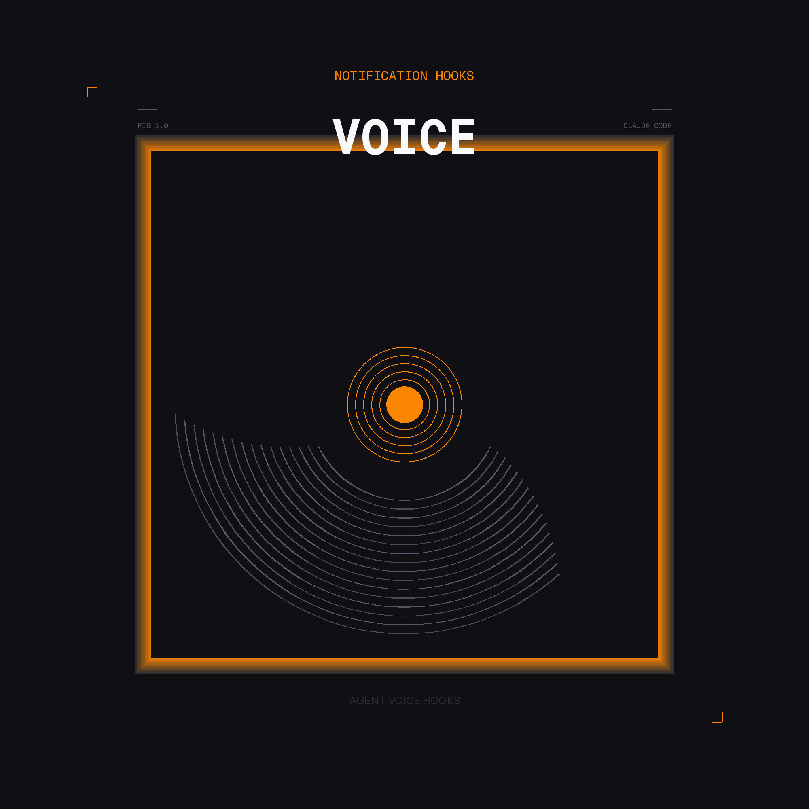

# Claude Voice Notification Hooks

<div align="center">
  
</div>

> **Turn Claude into a vocal collaborator** — get real-time voice announcements when tasks complete, permissions are needed, or your agent is waiting for you.

---

## Why Voice Hooks?

Claude Code is powerful, but keeping your eyes glued to the terminal isn't always practical. Voice hooks transform your AI agent into an active collaborator that speaks up when it needs you—so you can grab a coffee, switch contexts, or work on something else while Claude handles the heavy lifting.

**Perfect for:**
- Long-running tasks (tests, builds, deploys)
- Multitasking across projects
- Accessibility and screen-free workflows
- Keeping collaborators informed in pair programming sessions

---

## What You'll Hear

| Event | Voice Announcement | Example |
|-------|-------------------|---------|
| **Task completed** | "Done: [summary]" | "Done: Built and tested the application" |
| **Waiting for input** | "Claude is waiting for your input" | After 60 seconds of idle time |
| **Permission needed** | "Claude is waiting to [action]" | "Claude is waiting to Run hook installation test" |

> **Smart Context**: Permission announcements automatically extract what Claude is actually trying to do—so you hear the action, not just the tool name.

---

## Quick Start

### Step 1: Install VoiceMode (one-time, global)

```bash
curl -LsSf https://astral.sh/uv/install.sh | sh
uvx voice-mode-install
claude mcp add --scope user voicemode -- uvx --refresh voice-mode
```

*VoiceMode is the voice engine that powers these hooks. You only need to install it once.*

### Step 2: Install the Hooks Globally

Copy the hooks and settings to your global Claude configuration:

```bash
# Copy the hooks folder
cp -r .claude/hooks ~/.claude/

# Merge settings.json into your global config
cat .claude/settings.json >> ~/.claude/settings.json
```

*This enables voice notifications for **all** your Claude Code projects automatically.*

### Step 3: Test It

```bash
~/.claude/hooks/test-hooks.sh
```

You should hear voice confirmations for each event type.

---

## How It Works

These hooks use Claude Code's native hook system to listen for events and trigger voice announcements via VoiceMode:

| Hook File | Trigger | What It Does |
|-----------|---------|--------------|
| `permission-request.sh` | Permission dialog shown | Announces what Claude is waiting to do |
| `task-summary.sh` | Task completes | Reads the task summary aloud |
| `notification-idle.sh` | Idle for 60+ seconds | Reminds you that Claude is waiting |

All hooks are configured in `~/.claude/settings.json` using the `Notification` and `Stop` event types.

---

## Customization

### Changing the Voice

**Per-script (quick method):**

Edit the hook scripts directly to add a `voice` parameter:

```bash
~/.claude/hooks/permission-request.sh
~/.claude/hooks/task-summary.sh
~/.claude/hooks/notification-idle.sh
```

Each script calls `voicemode converse`. Add your preferred voice:

```bash
# Example: Use male voice
converse "Your message here" voice="am_adam"
```

**Available voices:**
- **Kokoro (local):** `af_sky`, `af_sarah`, `am_adam`, `am_michael`, `ef_dora`, `bm_george`, `bm_lewis`
- **OpenAI (cloud):** `nova`, `shimmer`, `alloy`, `echo`, `fable`, `onyx`

**Global default (recommended):**

Set a default voice for all VoiceMode conversations by editing `~/.voicemode/voicemode.env`:

```bash
# Add or edit these lines:
export VOICEMODE_VOICES="am_adam,alloy"           # Preferred voices (first available is used)
export VOICEMODE_KOKORO_DEFAULT_VOICE="am_adam"   # Default for local Kokoro TTS
```

This affects all VoiceMode usage system-wide, not just hooks.

**Other options:**
- `speed="1.5"` - Adjust playback speed (0.25 to 4.0)
- `tts_provider="kokoro"` - Force local vs OpenAI
- `tts_provider="openai"` - Force cloud TTS

See [VoiceMode parameter docs](https://voice-mode.readthedocs.io/en/latest/) for complete reference.

---

## Repository-Specific Configuration

Different projects can use different voices, speeds, or behaviors. Simply create a `.claude/hooks/` folder in your project directory and customize the hook scripts there.

**Example: Use a professional voice for work projects**

```bash
# In /projects/work/.claude/hooks/task-summary.sh
#!/usr/bin/env bash
voicemode converse -m "Work task completed" --voice am_adam --no-wait
```

**Example: Faster speech for prototyping**

```bash
# In /projects/prototype/.claude/hooks/task-summary.sh
#!/usr/bin/env bash
voicemode converse -m "Done" --voice af_sky --speed 1.5 --no-wait
```

See [REPOSITORY-CONFIG.md](./REPOSITORY-CONFIG.md) for complete guide with troubleshooting.

---

## Requirements

- **Claude Code** (latest version)
- **VoiceMode** MCP server (installed above)
- macOS or Linux

---

## License

MIT — feel free to use, modify, and distribute.

---

## About

Built to make Claude Code feel more like a pair programmer and less like a headless CLI. Contributions welcome!
